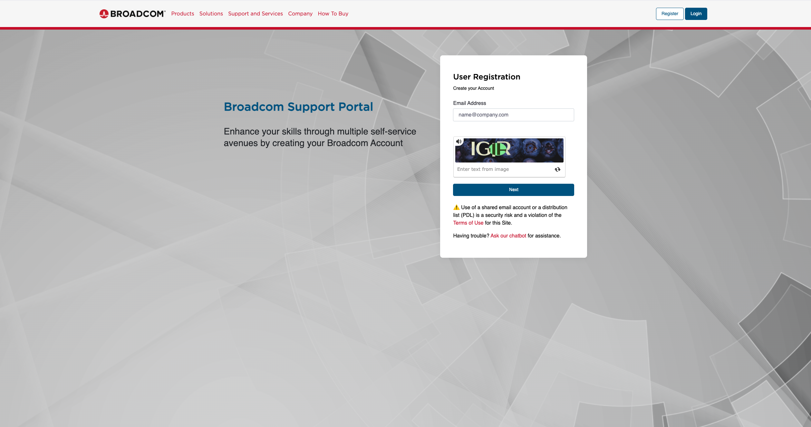
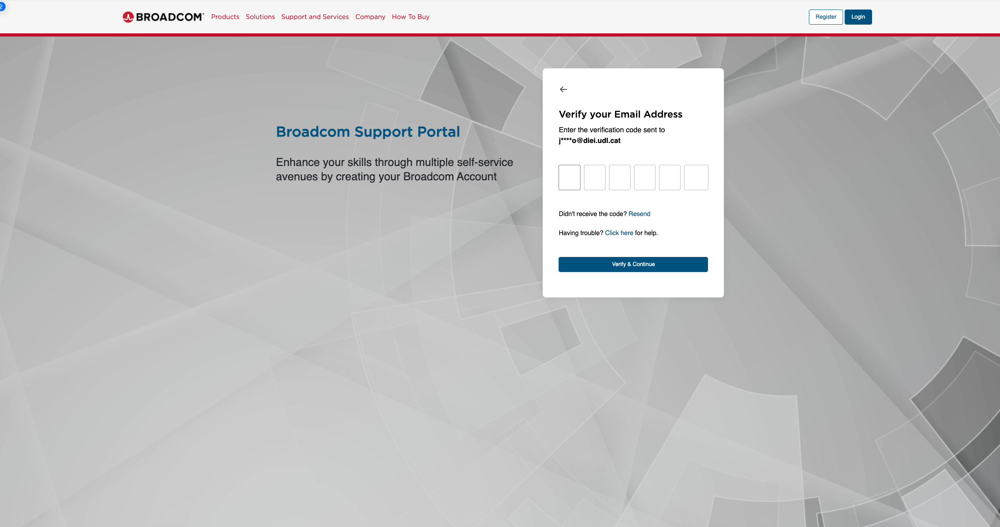
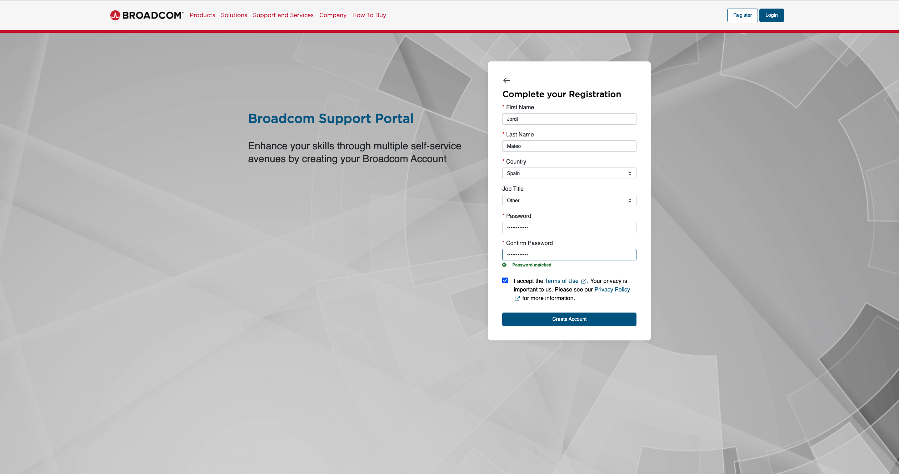
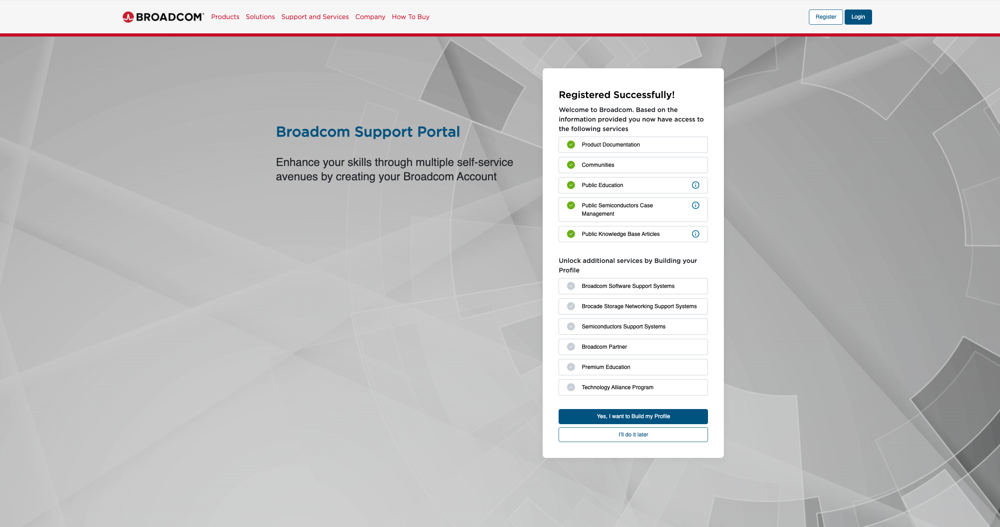
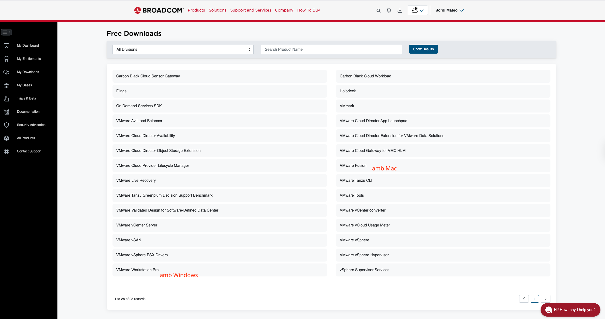
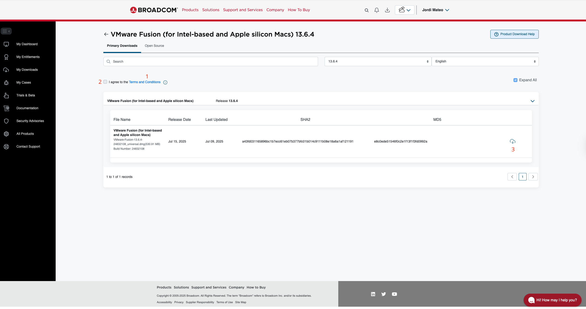

# Objectius

En aquesta pràctica aprendrem a:

- Comprovar que l'ordinador està preparat per executar màquines virtuals.
- Utilitzar **VMware Workstation Pro** o **VMware Fusion**.
- Crear i arrencar una màquina virtual amb **Alpine Linux**.
- Comprovar quin **maquinari virtual** veu la màquina.
- Comprovar experimentalment que la VM està **aïllada** del host (teclat, ratolí, porta-retalls).
- Modificar la **CPU i la RAM** assignades i observar-ne l'efecte.
- Comprovar que el treball fet dins la VM **consumeix recursos físics reals** del host.
- Executar dues VMs simultàniament i observar que **comparteixen recursos físics**.

# Preparem l'ordinador

## Comprova la virtualització per maquinari

Les màquines virtuals necessiten que l'ordinador pugui executar instruccions
de virtualització de manera eficient.

### Windows

Obre:

**Gestor de tasques → Rendiment → CPU**

Busca:

> **Virtualització: Activada**

::: {.callout-note}
Si el teu Windows està en anglès, l'opció apareix com **Task Manager → Performance → CPU → Virtualization: Enabled**.
:::

::: {.callout-warning}
Si apareix **Desactivada**, avisa el professor abans de continuar. En alguns ordinadors cal activar **Intel VT-x** o **AMD-V** des de la BIOS/UEFI.
:::

### macOS

En els Mac amb **Apple Silicon**, VMware Fusion utilitza les funcions de virtualització proporcionades per Apple. No cal buscar una opció VT-x a la BIOS. La virtualització acostuma a estar disponible per defecte.

## Quina arquitectura té el teu ordinador?

Anota:

**Sistema operatiu:** ______________________________________

**Arquitectura del processador:** ___________________________

Instruccions per comprovar l'arquitectura:

::: {.panel-tabset}

## Windows

1. Prem **Windows + I** per obrir **Configuració**.
2. Ves a **Sistema → Quant al dispositiu**.
3. Anota el valor de **Tipus de sistema**.

Alternativament, des del **Símbol del sistema** (cmd):

```text
echo %PROCESSOR_ARCHITECTURE%
```

## macOS

1. Obre **Terminal**.
2. Executa:

```bash
uname -m
```
:::

::: {.callout-tip}
Els ordinadors amb processadors Intel/AMD utilitzen habitualment **x86-64**, mentre que els Mac amb Apple Silicon utilitzen **ARM64**.
:::

# Instal·lació del Hypervisor

## Creació d'un compte a Broadcom i descàrrega de VMware

Aquestes instruccions et guiaran a través del procés per crear un compte a Broadcom i descarregar una de les versions gratuïtes de VMware Workstation Pro (per a Windows) o VMware Fusion (per a macOS).

1. Registra't per a un compte gratuït a Broadcom: per accedir a les descàrregues de programari de VMware, necessites un compte a la plataforma de Broadcom.
   - Dirigeix-te a la pàgina de registre de Broadcom: [https://profile.broadcom.com/web/registration](https://profile.broadcom.com/web/registration)
   - Introdueix la teva adreça de correu electrònic, realitza la verificació de seguretat i fes clic a *Next*
        

   - Introdueix el codi de verificació que has rebut al teu correu electrònic. Fes clic a **Verify** per continuar.
        

   - Completa el formulari de registre amb la teva informació personal i crea una contrasenya. Fes clic a **Create Account** per completar el registre.
        

   - Un cop completat el registre, visualitzaràs un missatge de registre correcte i et demanarà si vols completar el perfil. Selecciona **I will do it later** per continuar.
        

2. Accedeix a les descàrregues gratuïtes de VMware:
    - Ves a la pàgina de login de Broadcom: [https://profile.broadcom.com/web/login](https://profile.broadcom.com/web/login)
    - Inicia sessió amb el teu correu electrònic i la contrasenya que has creat.
    - Ves directament a la secció de descàrregues a [https://support.broadcom.com/group/ecx/free-downloads](https://support.broadcom.com/group/ecx/free-downloads).
        
    - Selecciona **VMware Workstation Pro** (Windows) o **VMware Fusion** (macOS) segons el teu sistema operatiu.
    - Selecciona la versió **26H1**, tant si tries Windows com macOS.
    - En la pàgina següent:
      1. Fes clic a l'enllaç de termes i condicions perquè s'activi el checkbox de l'acceptació.
      2. Accepta els termes i condicions.
      3. Fes clic a descàrrega per començar a descarregar el fitxer d'instal·lació.
        

3. Instal·la VMware Workstation Pro o VMware Fusion.

## Descarrega Alpine Linux

Navega a la pàgina oficial d'Alpine Linux: [https://alpinelinux.org/downloads/](https://alpinelinux.org/downloads/) i selecciona la imatge **VIRTUAL** que correspon a l'arquitectura del teu ordinador.

# Alpine: La nostra primera màquina virtual

## Creació de la màquina virtual

Crearem una màquina virtual anomenada: *vm-curs0-alpine*, amb les característiques següents:

| Recurs | Configuració |
|---|---:|
| CPU | **1 processador, 1 core per processador** |
| RAM | **512 MB** |
| Disc | **No necessari** |
| Xarxa | **NAT** |
| Sistema operatiu convidat | **Other Linux 5.x kernel 64-bit** (Alpine no hi apareix llistat) |

::: {.panel-tabset}

## Windows (VMware Workstation Pro)

1. Obre VMware Workstation Pro i selecciona **Create a New Virtual Machine**.
2. Tria **Custom (advanced)** i deixa la compatibilitat per defecte.
3. Selecciona **I will install the operating system later**.
4. Com a sistema convidat: **Linux → Other Linux 5.x kernel 64-bit**.
5. Anomena la VM **vm-curs0-alpine**.
6. A processadors: **Number of processors = 1**, **Number of cores per processor = 1**.
7. A memòria: **512 MB**.
8. A xarxa: **Use network address translation (NAT)**.
9. Acaba l'assistent (**Finish**) sense preocupar-te encara pel disc.
10. Obre **Edit virtual machine settings**, selecciona el disc dur i fes **Remove** — no el necessitem.

## macOS (VMware Fusion)

1. Obre VMware Fusion i fes **File → New...**
2. Selecciona **Create a custom virtual machine** (no "Install from disc or image").
3. Com a sistema convidat: **Linux → Other Linux 5.x kernel 64-bit**.
4. Deixa **Legacy BIOS** o **UEFI** per defecte.
5. Marca **Customize Settings** abans de crear-la i anomena-la **vm-curs0-alpine**.
6. A **Settings**:
   - **Processors & Memory**: 1 processador, 512 MB.
   - **Network Adapter**: **Share with my Mac (NAT)**.
   - **Hard Disk**: elimina'l amb el botó **–**.
:::

::: {.callout-note}
Alpine no apareix a la llista de distribucions convidades a cap dels dos programes. No passa res: l'opció genèrica **Other Linux 5.x kernel 64-bit** és suficient.
:::

::: {.callout-tip}
**Creus que Alpine Linux funcionarà amb només 512 MB de RAM?**

- [ ] Sí
- [ ] No
- [ ] No ho sé

**Per què?**

____________________________________________________________
:::

## Connectar Alpine i arrencar la VM

Obre la configuració de maquinari de la VM (**Edit virtual machine settings** a Windows, o l'engranatge de **Settings** a Mac).

Busca l'apartat del **CD/DVD** i indica que utilitzi un fitxer ISO (**Use ISO image file** / **Choose a disc or disc image**).

Selecciona la ISO d'Alpine i fes **Power on**.

::: {.callout-tip}
## Acabes de crear un ordinador virtual
VMware està proporcionant a Alpine: una CPU virtual, memòria RAM virtual, una interfície de xarxa virtual, i els altres dispositius virtuals necessaris per arrencar.
:::

## Entrar a Alpine Linux

Quan Alpine arrenqui, apareixerà una consola.

Inicia sessió com:

```text
root
```

En aquesta imatge d'Alpine no cal introduir cap contrasenya per iniciar
aquesta sessió temporal.

Hauries d'arribar a un prompt semblant a:

```text
localhost:~#
```

::: {.callout-warning}
En aquesta pràctica l'utilitzarem en mode **live**, arrencant des de la ISO. No farem cap instal·lació permanent. Això vol dir que qualsevol canvi que fem a la VM **no es conservarà** quan l'apaguem. No tenim cap disc virtual assignat a la VM, així que Alpine s'executa completament a la memòria RAM.
:::

## Què veu la màquina virtual?

Ara comprovarem experimentalment una de les idees principals de la teoria:

> **La VM té el seu propi maquinari virtual.**

Observa que, mentre la VM té el focus, el teclat i el ratolí responen al guest i no al host. Per alliberar el control del ratolí, prem la combinació de tecles: **Ctrl + Alt** (Windows) o **Ctrl + Cmd** (Mac).

Si no fem cap configuració especial, les funcions de copiar i enganxar entre el host i la VM no funcionen. Això és una altra prova que la VM està aïllada del host. Pots intentar copiar text de la VM i enganxar-lo al host, o viceversa: no funcionarà.

Aquesta VM té el teclat configurat amb el layout **US**. Intenta escriure `ls -la` i veuràs que la tecla `-` no té el mateix comportament que al teu ordinador. Per modificar el layout del teclat, executa `setup-keymap` i selecciona **es** a les dues preguntes que et farà (layout i variant).

::: {.callout-note}
`setup-keymap` et demanarà el layout i després la variant. Escriu **es** a totes dues.

Truc: escriu *setup* i prem **Tab** per autocompletar el nom del comandament i així no cal escriure el guionet.
:::

### Quantes CPU veu?

Executa:

```bash
grep -c '^processor' /proc/cpuinfo
```

**CPU que veu Alpine:** __________________

**CPU que havíem assignat a la VM:** __________________

**Coincideixen?**

- [ ] Sí
- [ ] No

### Quanta RAM veu?

Executa:

```bash
free -h
```

Busca la línia:

```text
Mem:
```

**RAM que veu Alpine:** __________________

**RAM assignada a la VM:** 512 MB

**És aproximadament el que esperaves?**

- [ ] Sí
- [ ] No

Ara executa `dmesg | grep -i memory` i observa el missatge que apareix. Aquest missatge és generat pel kernel d'Alpine quan arrenca i indica quanta memòria RAM veu.

### Quina arquitectura veu Alpine?

Executa:

```bash
uname -m
```

**Arquitectura que veu Alpine:** __________________

Ara compara-la amb l'arquitectura que has anotat a l'inici de la pràctica, a l'apartat **"Quina arquitectura té el teu ordinador?"**.

**Són iguals?**

- [ ] Sí
- [ ] No

::: {.callout-tip title="Pregunta de reflexió"}
**La VM sempre ha de veure exactament la mateixa arquitectura que l'ordinador físic?**

____________________________________________________________

____________________________________________________________
:::

### I la xarxa?

Executa:

```bash
ip addr
```

Observa les interfícies que apareixen.

**Quantes interfícies observes?** __________________

**Hi ha alguna interfície que representi la xarxa de la VM?**

____________________________________________________________

::: {.callout-note}
La interfície que veu Alpine és una **interfície de xarxa virtual**. VMware s'encarrega de connectar-la amb la xarxa física de l'ordinador. Si `eth0` apareix sense adreça IP o en estat `DOWN`, és normal en mode live; no cal solucionar-ho.
:::

### I el disc?

Executa:

```bash
df -h
```

Observa els sistemes de fitxers.

**Has creat algun disc virtual per a aquesta VM?**

- [ ] Sí
- [ ] No

**Com pot funcionar Alpine si no hem creat cap disc virtual?**

____________________________________________________________

____________________________________________________________

::: {.callout-note}
Alpine, en mode **live**, s'executa a partir de la ISO i utilitza la memòria RAM. No necessita un disc persistent per a aquesta pràctica.

Quan instal·lem un sistema operatiu que volem conservar, com farem en una pràctica posterior, sí que necessitarem un disc virtual persistent.
:::

::: {.callout-tip}
## Què acabem de comprovar?

La VM **no veu directament tot el maquinari físic**. Està veient una **representació virtual del maquinari** que VMware li proporciona.
:::

## Experiment: canviem la RAM

Ara farem exactament el que parlàvem a la teoria:

> **Canviar un recurs virtual i comprovar què passa dins de la VM.**

La VM actual té:

> **512 MB de RAM**

La canviarem a:

> **1 GB de RAM**

::: {.callout-tip}
**Quanta RAM creus que veurà Alpine després del canvi?**

__________________
:::

Primer apaga Alpine:

```bash
poweroff
```

Espera que la VM s'apagui completament.

A VMware:

1. Obre la configuració de la VM.
2. Busca **Memory**.
3. Canvia:

```text
512 MB → 1 GB
```

4. Torna a arrencar la VM.
5. Inicia sessió com `root`.
6. Executa:

```bash
free -h
```

**RAM que veu ara Alpine:** __________________

**Coincideix amb la teva predicció?**

- [ ] Sí
- [ ] No

**Què ha canviat?**

____________________________________________________________

____________________________________________________________

::: {.callout-tip}
El que hem fet és modificar un **recurs virtual**. Però aquest recurs virtual necessita RAM **física** del host.
:::

## Experiment: canviem la CPU

Ara farem el mateix experiment, però amb la CPU.

La VM actual té:

> **1 core**

La canviarem a:

> **2 cores**

::: {.callout-tip}
**Quants processadors creus que veurà Alpine després del canvi?**

__________________
:::

Primer apaga Alpine:

```bash
poweroff
```

A VMware, obre la configuració de la VM i modifica:

```text
Number of cores per processor: 1 → 2
```

Torna a arrencar la VM, inicia sessió com `root` i executa:

```bash
grep -c '^processor' /proc/cpuinfo
```

**CPU que veu Alpine:** __________________

**Coincideix amb la teva predicció?**

- [ ] Sí
- [ ] No

**Què ha canviat respecte a abans?**

____________________________________________________________

____________________________________________________________

::: {.callout-note}
Deixa la VM configurada amb **2 cores**: la farem servir a l'experiment següent.
:::

## Experiment: fem treballar la CPU

Fins ara hem comprovat que la CPU virtual **existeix**. Ara comprovarem que **també fa treball real**.

::: {.callout-tip}
### Abans de començar: fes una predicció

Estem a punt d'executar dins la VM un procés que fa treballar la CPU al màxim de manera continuada.

**Quin percentatge de CPU creus que consumirà, dins d'Alpine?**

__________________

**I creus que el teu ordinador físic (el host) notarà aquest treball d'alguna manera?**

- [ ] Sí
- [ ] No
- [ ] No ho sé
:::

### Genera treball de CPU dins la VM

Executa:

```bash
yes > /dev/null &
```

Aquest comandament llança un procés que repeteix una tasca sense parar, en segon pla (`&`).

Ara observa els processos actius:

```bash
top
```

Busca la línia corresponent al procés `yes` i fixa't en la columna **%CPU**.

**Quin percentatge de CPU consumeix `yes` dins d'Alpine?** __________________

**Coincideix amb la teva predicció?**

- [ ] Sí
- [ ] No

::: {.callout-note}
Com que a l'experiment anterior has configurat la VM amb **2 cores**, pot ser que `yes` mostri un percentatge proper al 100%, ja que és un sol procés i només pot fer servir un core alhora.
:::

### Comprova-ho també al host

Sense tancar `top`, mira ara el **teu ordinador físic**:

- **Windows:** obre el **Gestor de tasques → Rendiment**, o la pestanya **Processos** i busca **VMware Workstation** / `vmware-vmx.exe`.
- **macOS:** obre el **Monitor d'activitat** i busca **VMware Fusion** o `vmware-vmx`.

::: {.callout-warning}
No busquis un procés anomenat `yes` al host: **no hi apareixerà**. El procés `yes` viu dins la VM; el que veurà el host és el propi procés de VMware (`vmware-vmx`) consumint més CPU física, perquè és ell qui executa realment la CPU virtual per compte de la VM.
:::

**Quant de CPU física consumeix el procés de VMware al host?** __________________

::: {.callout-tip}
### Connecta-ho amb la teoria

La CPU que acaba de treballar dins la VM **no és una CPU imaginària**. El treball que hem generat amb `yes` s'ha traduït en consum real de CPU **física** del host, gestionat pel procés de VMware.

**Virtual ≠ imaginari.**
:::

### Atura el procés

Surt de `top` prement:

```text
q
```

Després atura el procés `yes`:

```bash
kill %1
```

::: {.callout-note}
Si `kill %1` respon amb un error com `no such job`, prova en canvi:

```bash
pkill yes
```
:::

Comprova que el procés `yes` ha desaparegut executant `top` de nou, i que el consum de CPU del procés de VMware al host també ha baixat.

## Dues VMs alhora

L'objectiu és observar una altra idea de la teoria:

> **Les VMs estan aïllades, però comparteixen els recursos físics.**

### Prepara una segona VM

Crea una segona VM d'Alpine o clona l'actual.

Anomena-la, per exemple:

```text
vm-curs0-alpine-2
```

Configura-la amb:

- **1 processador, 1 core per processador**
- **512 MB o 1 GB de RAM**

Arrenca les dues VMs alhora.

### Fes treballar una VM

A la primera VM executa:

```bash
yes > /dev/null &
```

I observa amb:

```bash
top
```

A l'altra VM observa també el seu sistema.

**Notes algun canvi de rendiment?**

- [ ] Sí
- [ ] No
- [ ] No ho sé notar

**Per què creus que pot passar?**

____________________________________________________________

____________________________________________________________

::: {.callout-tip}
Cada VM té el seu propi entorn i els seus propis processos, però les dues comparteixen el **mateix maquinari físic del host**. Per això, una VM que consumeix molts recursos pot afectar el rendiment de les altres. **Aïllament ≠ independència total de recursos.**
:::

# Resum: Els recursos són finits

Tornem al problema de la teoria.

Suposem un ordinador amb:

> **16 GB de RAM**

I volem executar:

| VM | RAM assignada |
|---|---:|
| VM 1 | 4 GB |
| VM 2 | 4 GB |
| VM 3 | 4 GB |

## Pregunta 1

**Quanta RAM hem assignat en total a les VMs?**

__________________

## Pregunta 2

**Quanta RAM queda teòricament?**

__________________

## Pregunta 3

Podem assignar els 4 GB restants a una quarta VM?

- [ ] Sí, sense cap problema.
- [ ] Sí, però cal tenir en compte el host.
- [ ] No, mai podem crear una quarta VM.

## Pregunta 4

**Per què?**

____________________________________________________________

____________________________________________________________

::: {.callout-note}
En un sistema real, el **host també necessita recursos** per funcionar i la virtualització té un cert cost. Per tant, no podem considerar tota la RAM física com a disponible per a les màquines virtuals. El mateix aplica a la CPU i a la resta de recursos. Sempre hem de deixar una part per al host.
:::
