# Objectius

En aquesta pràctica aprendrem a:

- Crear i configurar una màquina virtual preparada per instal·lar un sistema
  operatiu.
- Instal·lar **Debian 12** dins d'una màquina virtual.
- Entendre les principals decisions que prenem durant la instal·lació d'un
  sistema Linux.
- Configurar la xarxa, els usuaris i el sistema de fitxers.
- Instal·lar un sistema Debian en **mode text**, sense interfície gràfica.
- Accedir al sistema i començar a treballar amb la línia de comandes.

::: {.callout-tip}
Aquesta pràctica continua directament el que hem fet al **Laboratori 1**. Partim de VMware instal·lat i de la ISO de Debian disponible.
:::

# Obtenir la ISO de Debian 12.5

- Ves a la pàgina de descàrrega de Debian 12.5.0: https://get.debian.org/images/archive/12.5.0/
- Selecciona la imatge ISO per a la teva arquitectura (amd64 o arm64). 
- Seleccioneu la carpeta **iso-cd**.
- Seleccioneu el fitxer **debian-12.5.0-x-netinst.iso**. On x és l’arquitectura del vostre sistema (amd64 o arm64).

:::{.callout-note}

La imatge **netinst** és una imatge d’instal·lació mínima que descarrega els paquets necessaris durant la instal·lació. Això permet personalitzar la instal·lació i seleccionar els paquets que voleu instal·lar.

:::

# Preparar la màquina virtual

En el Laboratori 1 hem creat una màquina virtual senzilla per experimentar
amb la virtualització.

Ara crearem una nova màquina virtual que utilitzarem per instal·lar Debian.

Els passos són similars als que vam seguir en el Laboratori 1.

::: {.callout-tip}
En el Laboratori 1 vam utilitzar una màquina virtual amb Alpine Linux per experimentar amb els recursos. Ara farem una màquina virtual pensada per instal·lar-hi un sistema operatiu de manera permanent.
:::

VMware et preguntarà quin sistema operatiu instal·laràs.

Selecciona:

- **Linux**
- **Debian 12.x 64-bit**, si aquesta opció està disponible.

Configurarem una màquina virtual amb uns recursos suficients per treballar amb Debian en mode text.

| Recurs | Configuració |
|---|---:|
| CPU | **2 cores** |
| RAM | **2 GB** |
| Disc | **20 GB** |
| Xarxa | NAT |
| ISO | Debian 12 netinst |

Pots anomenar la màquina virtual com vulguis, però és recomanable posar un nom que permeti identificar-la fàcilment: `vm-curs0-debian12`.

Selecciona també una ubicació on tinguis prou espai lliure.

::: {.callout-warning}
Recorda que el disc virtual de la màquina virtual és un fitxer o conjunt de
fitxers que es guarda al disc real de l'ordinador host.
:::

Connecta la ISO de Debian a la màquina virtual abans d'arrencar-la.

# Arrencar l'instal·lador de Debian

Inicia la màquina virtual amb:

**Power on**

La màquina virtual arrencarà des de la ISO i apareixerà el menú de l'instal·lador de Debian.

Veurem diverses opcions.

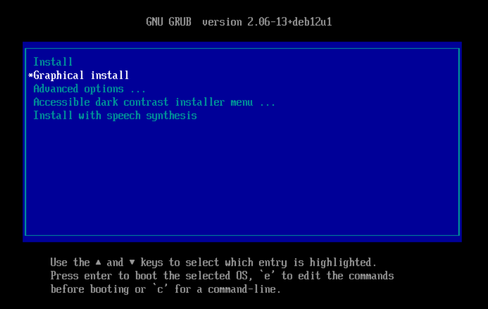

Selecciona:

**Graphical install**

::: {.callout-note}
També existeix l'opció **Install**, que utilitza un instal·lador basat en text.

En aquesta pràctica utilitzarem **Graphical install** perquè és més còmode
per seguir els diferents passos de configuració.

Això no significa que el Debian que instal·larem tingui interfície gràfica. L'entorn gràfic que veiem ara només és el de l'instal·lador.
:::

# Seleccionar l'idioma

Selecciona l'idioma que vols utilitzar durant la instal·lació.

En aquest curs utilitzarem:

**Català**

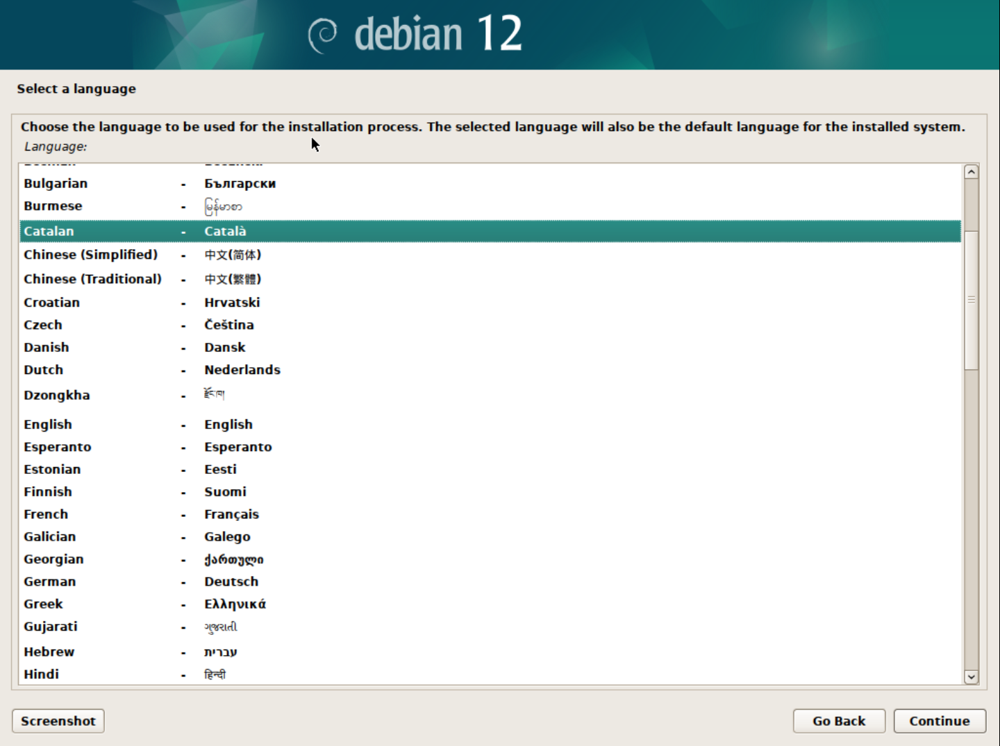

L'idioma seleccionat afectarà les pantalles de configuració de l'instal·lador
i algunes configuracions inicials del sistema.

# Seleccionar la ubicació

Selecciona:

**Espanya**

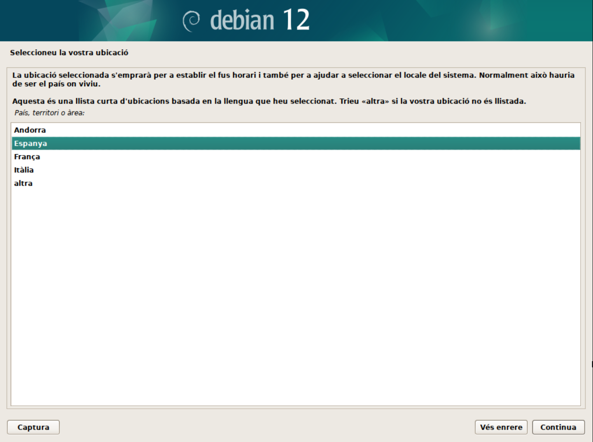

La ubicació permet configurar alguns paràmetres regionals del sistema.

# Configurar el teclat

Selecciona:

**Català**

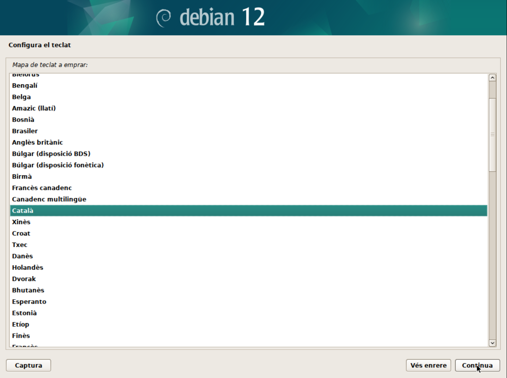

Això permet que el sistema interpreti correctament les tecles del teclat,
especialment caràcters com:

- `ç`
- accents
- `@`
- símbols especials

::: {.callout-note}
La configuració del teclat és independent de l'idioma del sistema.
Podem tenir un sistema en català i utilitzar, per exemple, un teclat
espanyol.
:::

# Carregar els components de l'instal·lador

Debian carregarà els components necessaris per continuar la instal·lació.

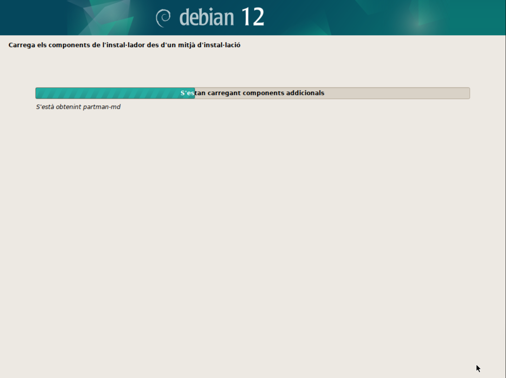

En aquest punt no cal modificar res.

Simplement espera que finalitzi el procés.

# Configurar la xarxa

Debian intentarà configurar automàticament la xarxa de la màquina virtual.

A VMware, normalment utilitzarem una connexió de tipus **NAT**.

Això permet que la màquina virtual tingui accés a Internet utilitzant la
connexió de l'ordinador host.

## Nom de la màquina

El primer pas és configurar el **hostname**.

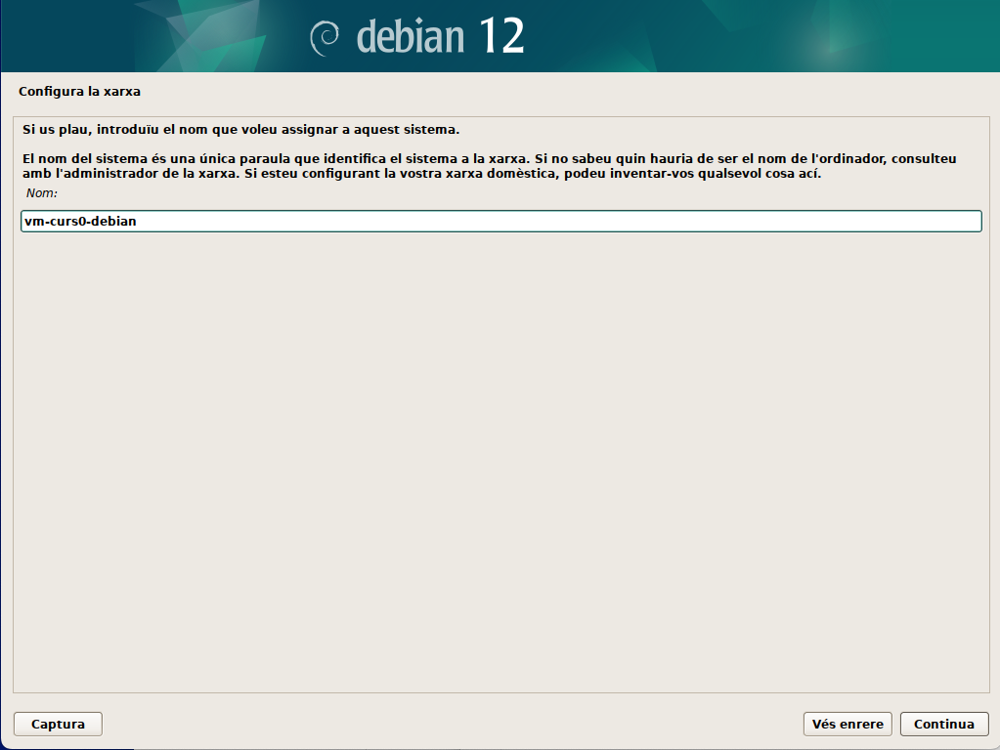

El hostname és el nom que identifica la màquina dins de la xarxa.

Podem utilitzar, per exemple:

`vm-curs0-debian12`

També pots utilitzar un altre nom.

::: {.callout-note}
Més endavant, quan treballem amb xarxes i servidors, el hostname serà
especialment important perquè permetrà identificar diferents màquines.
:::

## Domini

A continuació es demanarà el nom del domini.

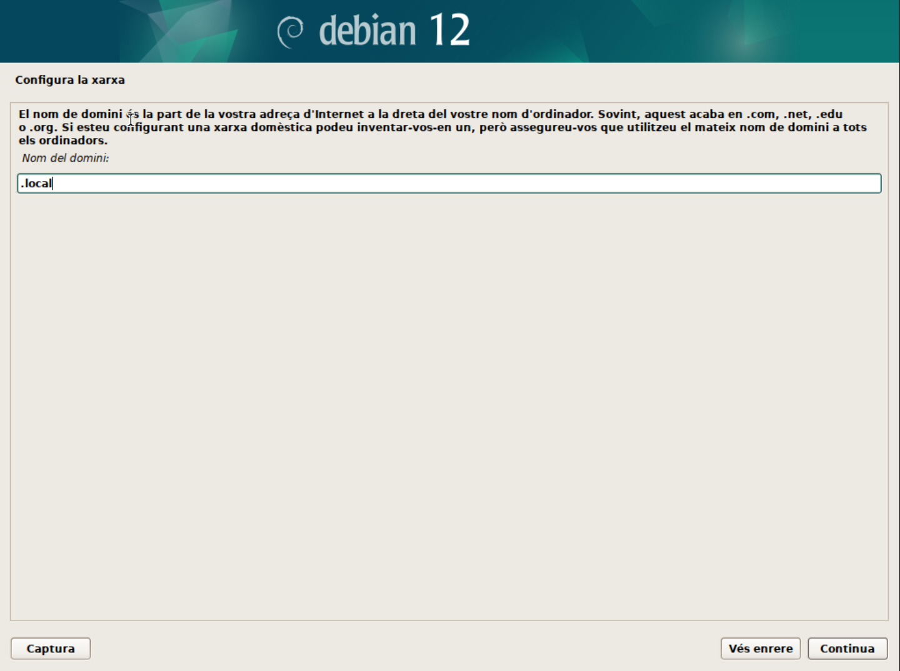

En el nostre cas podem deixar aquest camp **en blanc**.

No necessitem configurar cap domini per a aquesta pràctica.

::: {.callout-note}
Un domini permet agrupar i identificar màquines dins d'una infraestructura
de xarxa. En una xarxa domèstica o en aquesta pràctica no necessitem disposar
d'un domini propi.
:::

# Configurar els usuaris

A continuació Debian ens preguntarà com volem configurar els usuaris.

Aquesta és una part important de la instal·lació perquè Linux diferencia
entre usuaris normals i l'usuari administrador.

## L'usuari `root`

Debian ens permet configurar una contrasenya per a l'usuari `root`.

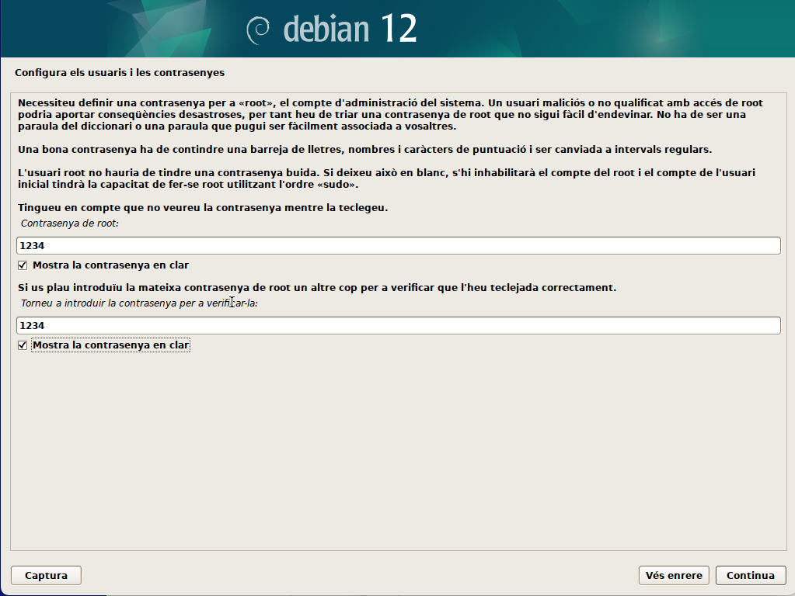

`root` és l'usuari administrador del sistema.

Té permisos per realitzar pràcticament qualsevol operació sobre el sistema.

### Una decisió important

Si **no introduïm cap contrasenya per a `root`**, Debian desactivarà
l'accés directe de `root` mitjançant contrasenya i configurarà el primer
usuari normal amb permisos administratius mitjançant `sudo`.

Si, en canvi, configurem una contrasenya per a `root`, podrem iniciar sessió
com a `root`.

::: {.callout-note}
En aquesta pràctica treballarem principalment amb un usuari normal i
utilitzarem `sudo` quan necessitem permisos d'administrador.

Aquesta és una pràctica habitual en sistemes Linux perquè evita treballar
constantment com a `root`.
:::

# Crear l'usuari normal

Ara crearem el nostre usuari.

## Nom complet

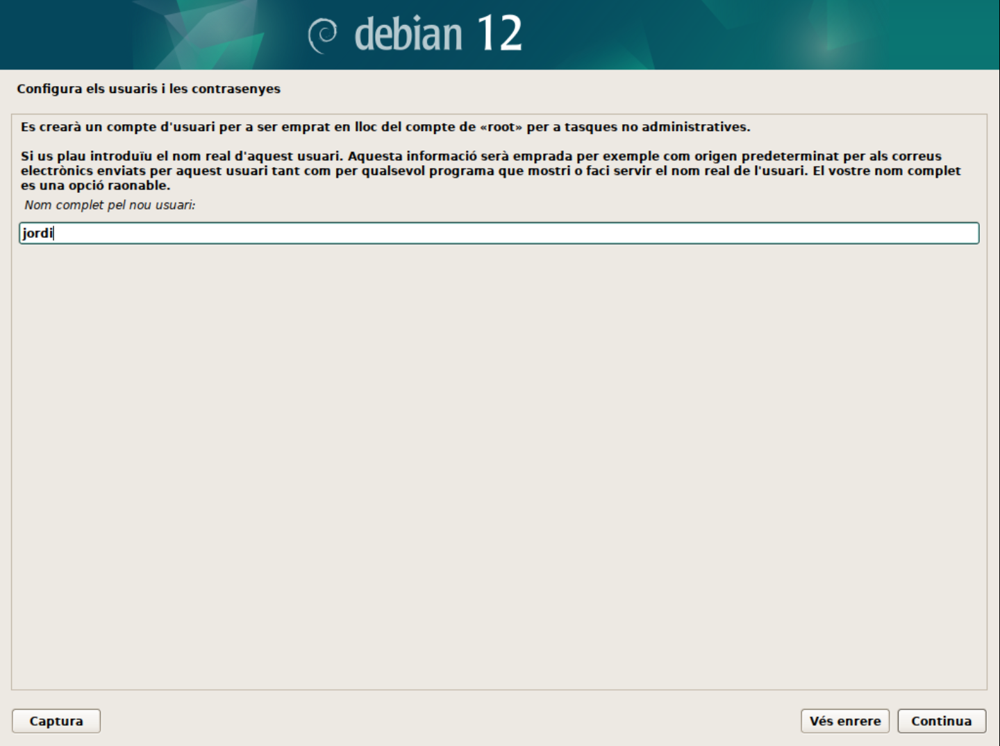

Introdueix el teu nom complet.

Per exemple:

`Jordi Mateo Fornés`

## Nom d'usuari

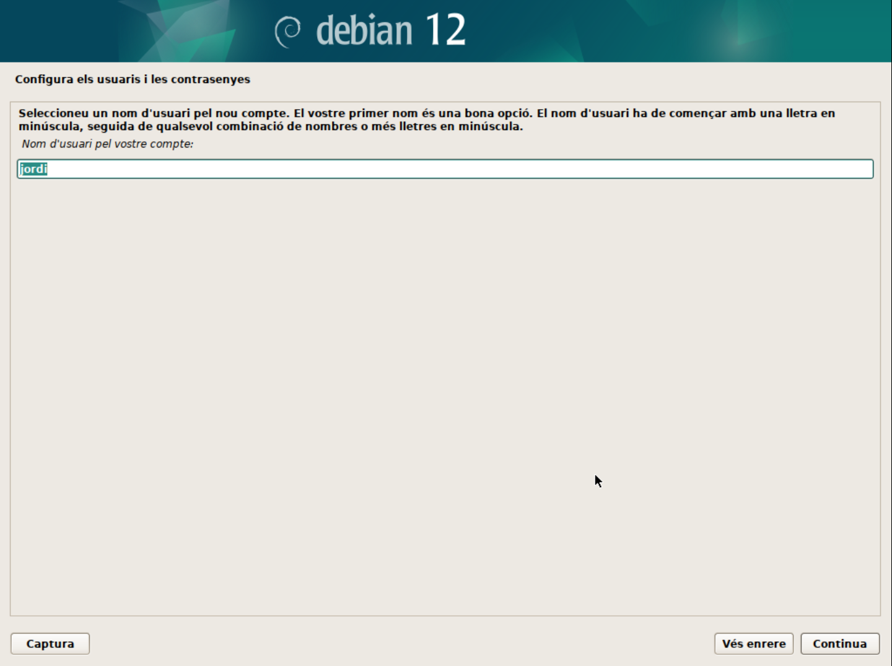

Introdueix el nom d'usuari que utilitzaràs per iniciar sessió.

Per exemple:

`jordi`

Aquest nom serà el que utilitzarem posteriorment a la terminal.

## Contrasenya

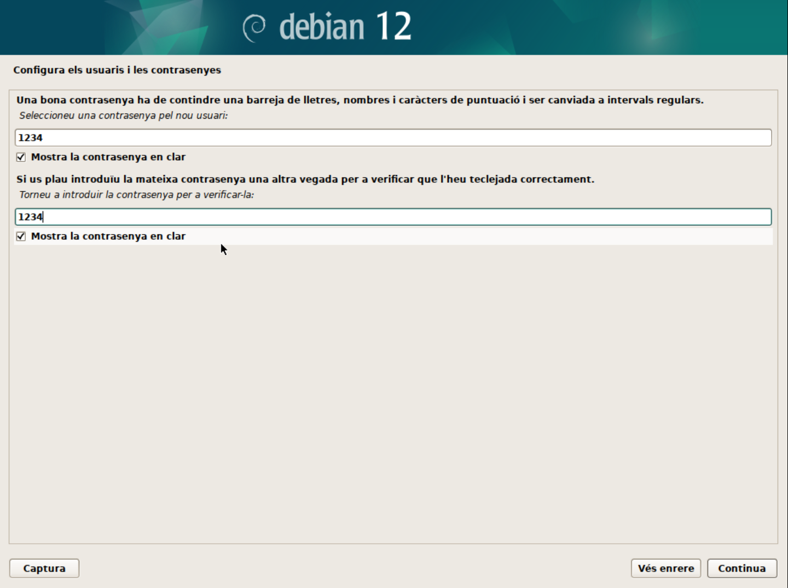

Defineix una contrasenya per a l'usuari.

::: {.callout-warning}
Com que aquesta màquina virtual s'utilitzarà exclusivament per a
pràctiques, pots utilitzar una contrasenya senzilla que recordis fàcilment.

**No utilitzis aquesta contrasenya en sistemes reals o comptes personals.**

En un sistema real, les contrasenyes han de ser prou robustes i no s'han de
reutilitzar entre serveis.
:::

# Configurar la zona horària

Selecciona:

**Madrid**

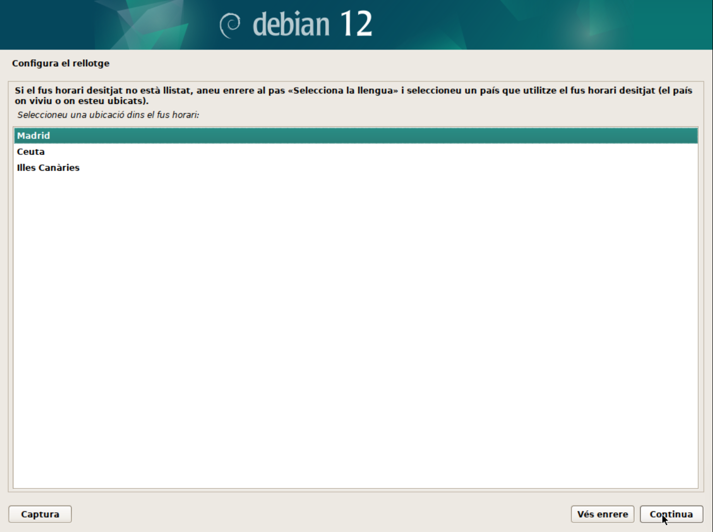

Això permet que Debian utilitzi correctament la zona horària local.

La configuració de l'hora és important per a molts serveis del sistema,
registres, certificats i aplicacions.

# Configurar el disc

Ara arribem a una de les parts més importants de la instal·lació:

**el particionament del disc.**

## Particionament guiat

Selecciona:

**Guiat - utilitzar el disc sencer**

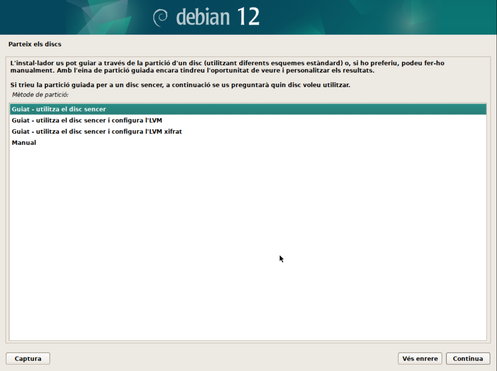

::: {.callout-warning}
Aquí estem treballant amb el **disc virtual de la màquina virtual**, no amb
el disc físic del teu ordinador.

El disc que Debian veu dins de la VM és el disc virtual que hem creat
anteriorment.
:::

Això és precisament un dels avantatges de treballar amb una màquina virtual:
podem experimentar amb la instal·lació d'un sistema operatiu sense
modificar directament el disc físic del nostre ordinador.

## Seleccionar el disc

Debian mostrarà els discs disponibles.

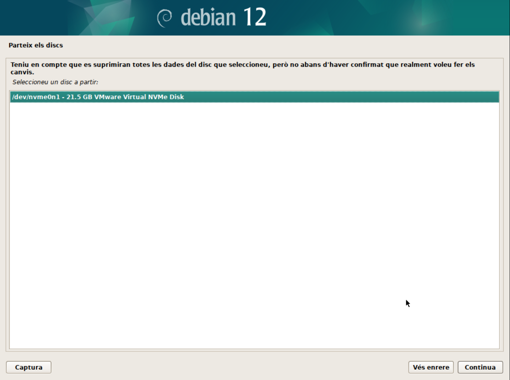

En el nostre cas només hauríem de veure el disc virtual que hem creat per a
la màquina.

Pot aparèixer amb un nom com:

`/dev/nvme0n1`

També podem trobar altres noms en diferents configuracions:

- `/dev/sda`
- `/dev/vda`

El nom depèn del tipus de dispositiu que Debian detecta.

::: {.callout-note}
No cal memoritzar ara els noms dels dispositius.

Més endavant, quan treballem amb Linux, aprendrem què significa aquesta
nomenclatura.
:::

## Esquema de particions

Selecciona:

**Tots els fitxers en una partició**

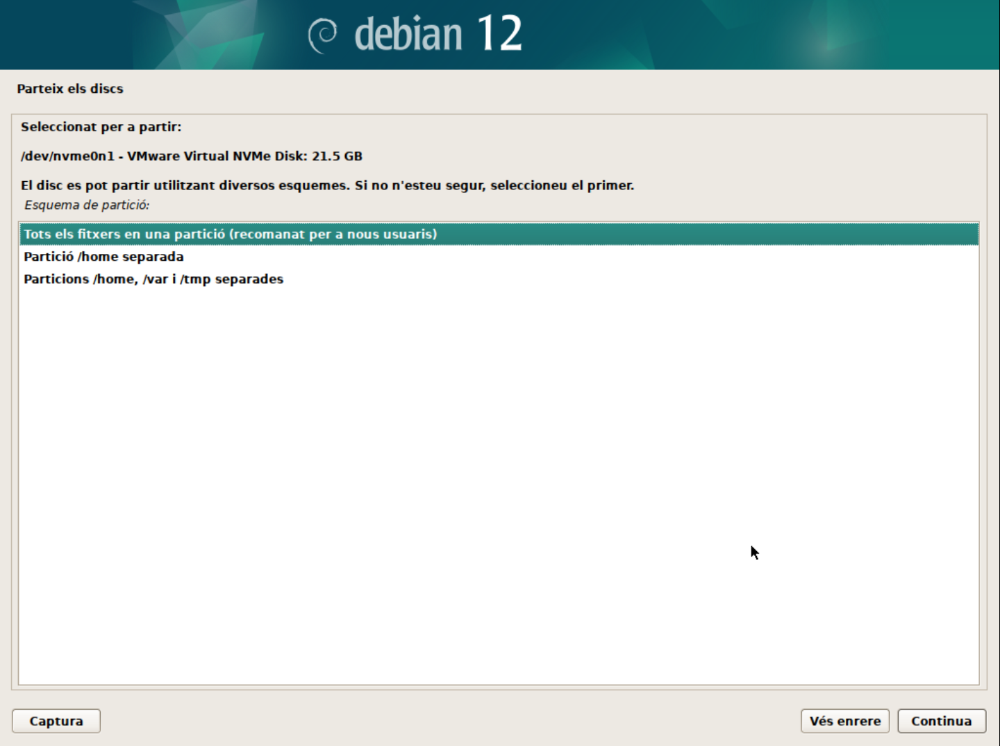

Aquesta és l'opció més senzilla per a aquesta pràctica.

Debian crearà automàticament les particions necessàries.

## Revisar les particions

Abans d'aplicar els canvis, Debian mostrarà el resum del particionament.

En una instal·lació típica podem trobar particions com:

- una partició d'arrencada, com `/boot` o una partició EFI segons la
  configuració;
- la partició principal `/`, on es troba el sistema;
- una àrea de `swap`.

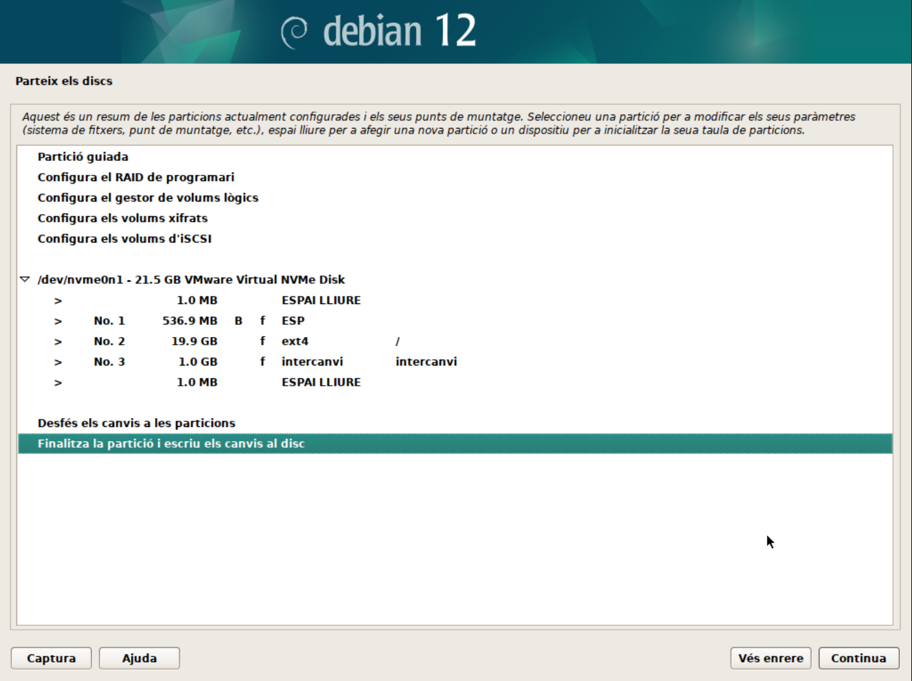

### Què és `swap`?

La `swap` és espai d'emmagatzematge que Linux pot utilitzar com a memòria
virtual quan la RAM disponible no és suficient.

No és equivalent a la RAM: és molt més lenta, perquè utilitza
emmagatzematge.

::: {.callout-note}
Aquesta és una primera aproximació al concepte de `swap`. Més endavant
veurem amb més detall com Linux gestiona la memòria.
:::

## Confirmar els canvis

Selecciona l'opció per finalitzar el particionament i escriure els canvis
al disc.

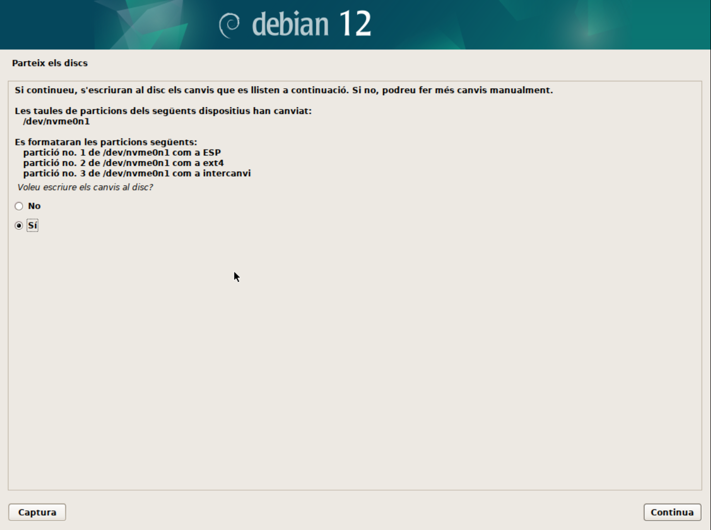

Debian demanarà confirmació abans d'escriure els canvis.

::: {.callout-warning}
En aquest punt estem modificant el **disc virtual** de Debian.

Com que estem treballant dins d'una màquina virtual, no estem particionant
directament el disc físic de l'ordinador host.
:::

Confirma els canvis.

# Instal·lar el sistema base

Debian començarà a copiar i instal·lar els components necessaris.

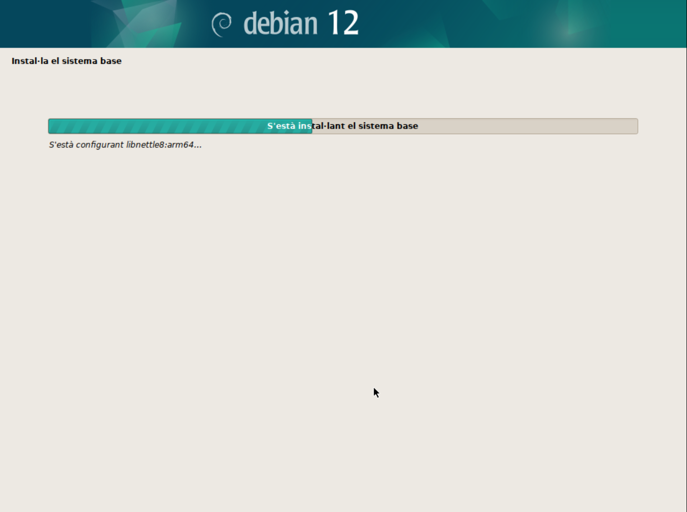

Aquest procés pot trigar uns minuts.

No cal intervenir mentre s'està instal·lant el sistema base.

# Configurar el gestor de paquets

Un cop instal·lat el sistema base, Debian configurarà el seu sistema de
paquets.

## Analitzar els mitjans d'instal·lació

Debian pot preguntar si vols analitzar altres mitjans d'instal·lació.

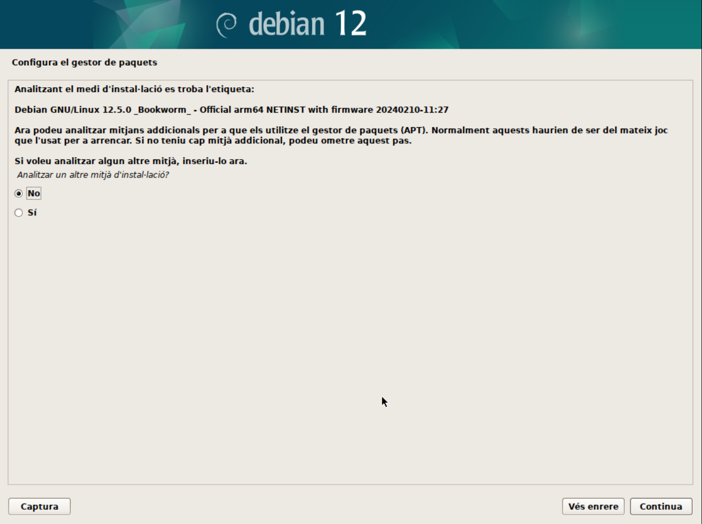

En la nostra instal·lació només utilitzarem la ISO que ja hem connectat.

Normalment no cal afegir cap altre mitjà.

## Seleccionar un servidor de paquets

Debian utilitza repositoris de programari per descarregar paquets.

Primer seleccionarem la ubicació del servidor.

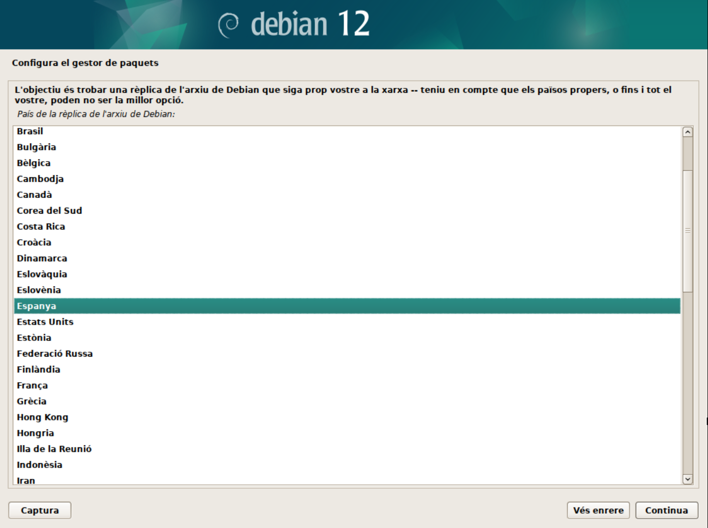

Selecciona:

**Espanya**

A continuació selecciona un servidor disponible.

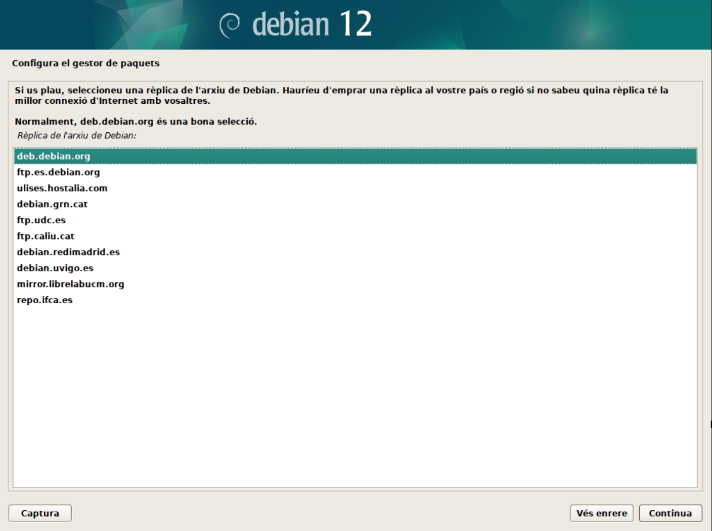

::: {.callout-note}
Els repositoris són servidors que proporcionen els paquets de programari de
Debian.

Més endavant, quan instal·lem programari amb `apt`, serà d'aquests
repositoris d'on es descarregaran els paquets.
:::

## Configurar un proxy

Debian preguntarà si necessitem configurar un proxy.

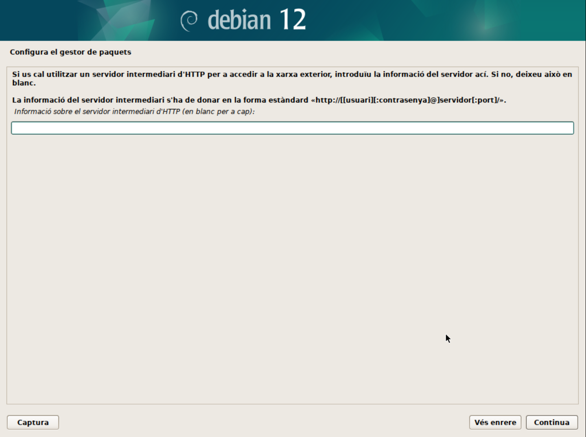

En la nostra situació normalment podem deixar aquest camp **en blanc**.

### Què és un proxy?

Un **proxy** és un servidor intermediari entre un ordinador i altres
servidors de la xarxa.

Per exemple:

```text
Ordinador → Proxy → Internet
```

En una xarxa corporativa o educativa, un proxy pot utilitzar-se per controlar
l'accés a Internet, aplicar polítiques de seguretat o gestionar les
connexions.

En una xarxa domèstica normalment no és necessari configurar-ne un.

# Instal·lar els paquets

Debian descarregarà i instal·larà els paquets necessaris.

Aquest procés pot trigar una mica depenent de la connexió de xarxa.

# Popularity Contest

Debian pot preguntar si vols participar en el programa:

**popularity-contest**

Aquest sistema recopila informació estadística sobre l'ús dels paquets de
Debian per ajudar el projecte a conèixer quins paquets són més utilitzats.

Pots seleccionar l'opció que prefereixis.

::: {.callout-note}
No és necessari participar en aquest programa per poder utilitzar Debian.
:::

# Seleccionar el programari

Aquest és un dels punts més importants de la instal·lació.

Debian ens permet seleccionar diferents tipus de programari.

En aquesta pràctica seleccionarem:

- **Servidor SSH**
- **Utilitats estàndard del sistema**

I no seleccionarem cap entorn d'escriptori gràfic.

Per tant, treballarem amb un Debian en mode text.

## Per què no instal·lem una interfície gràfica?

Un sistema Linux no necessita obligatòriament una interfície gràfica.

Podem interactuar directament amb el sistema mitjançant una terminal.

Per exemple:

```text
usuari@debian:~$
```

Aquest tipus d'instal·lació és habitual en servidors.

::: {.callout-note}
Un servidor no necessita necessàriament tenir una pantalla ni un entorn
gràfic.

Molts servidors Linux es gestionen completament des de la línia de
comandes, sovint de manera remota mitjançant SSH.
:::

## Què és SSH?

SSH (Secure Shell) és un protocol que permet connectar-se de manera
segura a un altre ordinador a través de la xarxa.

Conceptualment:

```text
El teu ordinador
       │
       │ SSH
       ↓
Servidor Debian
```

Això permet administrar un servidor sense haver d'estar físicament davant
de la seva pantalla.

::: {.callout-note}
No necessitem aprofundir ara en SSH. El més important és entendre que ens
permetrà treballar amb un sistema Linux remot mitjançant la terminal.
:::

# Instal·lar el programari seleccionat

Debian començarà a instal·lar els paquets seleccionats.

Aquest procés pot trigar uns minuts.

# Instal·lar GRUB

A continuació Debian preguntarà si vols instal·lar el gestor d'arrencada
GRUB.

Selecciona que sí.

Quan demani on instal·lar-lo, selecciona el disc virtual principal de
la màquina.

::: {.callout-note}
GRUB és el programa que participa en el procés d'arrencada i permet carregar
el sistema operatiu.

En una màquina virtual amb un únic sistema operatiu, normalment no cal
prendre cap decisió especial: l'instal·larem al disc virtual principal.
:::

# Finalitzar la instal·lació

Quan la instal·lació finalitzi apareixerà un missatge indicant que el procés
s'ha completat.

Debian reiniciarà la màquina virtual.

::: {.callout-warning}
Quan la màquina es reiniciï, és important que no torni a començar
l'instal·lador des de la ISO.

Si VMware manté la ISO connectada, pot ser necessari desconnectar-la de la
unitat virtual de CD/DVD.
:::

# Arrencar Debian

Després del reinici apareixerà GRUB.

Selecciona:

**Debian GNU/Linux**

Debian començarà el procés d'arrencada.

::: {.callout-note}
GRUB és especialment útil quan un ordinador té diversos sistemes operatius
o diverses opcions d'arrencada.

En la nostra màquina només tenim Debian, però GRUB continua sent necessari
com a part del procés d'arrencada.
:::

# Iniciar sessió

Quan Debian hagi acabat d'arrencar apareixerà la pantalla d'inici de sessió.

Introdueix:

- el nom d'usuari que has creat;
- la contrasenya corresponent.

::: {.callout-warning}
Quan escriguis la contrasenya, no apareixerà cap caràcter a la pantalla.

Això és normal en sistemes Unix/Linux.

Escriu la contrasenya i prem Enter.
:::

Si tot ha anat bé, apareixerà una línia semblant a:

```text
usuari@debian:~$
```

🎉 Ja tenim Debian funcionant dins de la nostra màquina virtual.

# Comprovar el sistema

Ara que tenim Debian funcionant, podem començar a observar el sistema des
de dins.

## Qui sóc?

Executa:

```bash
whoami
```

La comanda mostrarà el nom de l'usuari amb el qual has iniciat sessió.

# Tancar la sessió

Quan vulguis sortir de la sessió de l'usuari pots executar:

```bash
exit
```

Això tanca la sessió actual.

# Entrar com a root

Si durant la instal·lació has configurat una contrasenya per a root, pots
iniciar una sessió com a administrador.

Quan aparegui el login, introdueix:

```text
root
```

i la contrasenya corresponent.

::: {.callout-warning}
Treballar com a root significa tenir permisos molt amplis sobre el sistema.

No és recomanable utilitzar root per treballar habitualment. En general,
és preferible utilitzar un usuari normal i executar amb sudo només les
comandes que necessitin permisos administratius.
:::

## Comprovació final: què veu Debian?

Executa cada comandament dins de Debian i compara el resultat amb el que
vam configurar durant la pràctica.

| Recurs | Comanda | Què havíem configurat | El teu resultat |
|---|---|---|---|
| CPU | `lscpu` | 2 cores (creació de la VM) | |
| Memòria | `free -h` | 2 GB de RAM (creació de la VM) | |
| Disc (particions) | `lsblk` | Disc de 20 GB, particionament guiat | |
| Disc (ús) | `df -h` | Espai utilitzat pel sistema a `/` | |
| Xarxa | `ip a` | Connexió NAT amb una IP assignada | |
| Nom de la màquina | `hostname` | El nom que vam triar durant la instal·lació | |
| Sistema | `uname -a` | Kernel Linux i arquitectura de la VM | |


Ara que sabem identificar els recursos de la màquina virtual, comprovarem
què hi ha realment darrere.

### El disc virtual és un fitxer

Apaga la màquina virtual i ves a la carpeta on VMware ha creat la VM.

Localitza els fitxers associats al disc virtual (normalment amb extensió `.vmdk`).

::: {.callout-note}
**Pregunta**

Si el disc virtual de 20 GB és, en realitat, un fitxer del nostre ordinador físic, què creus que passarà si eliminem aquest fitxer?
:::

::: {.callout-warning}
No cal eliminar-lo de debò!
:::

**El disc virtual conté les dades de la màquina virtual.** Si l'eliminéssim, VMware ja no trobaria el disc necessari per arrencar Debian.

> La màquina virtual sembla tenir un disc propi, però aquest disc està emmagatzemat físicament al host, en forma d'un únic fitxer.

```text
Host
  → fitxer .vmdk
  → VMware el presenta com un disc virtual
Guest
  → lsblk mostra el disc (p. ex. /dev/sda o /dev/nvme0n1)
  → Debian el tracta com un disc normal
```

### Quant ocupa realment el disc?

Comprova el disc des de Debian:

```bash
lsblk
```

Hauries de veure un disc d'aproximadament 20 GB.

Ara compara-ho amb:

```bash
df -h
```

Els dos comandaments no mostren exactament el mateix.

::: {.callout-note}
### Per què no coincideixen?

`lsblk` mostra els **dispositius i les particions** del disc.

`df -h` mostra l'**espai dels sistemes de fitxers** que estan muntats.

Un disc virtual de 20 GB no significa que els 20 GB apareguin com a espai disponible per als fitxers: el disc conté particions i sistemes de fitxers, que ocupen espai propi.
:::

### La xarxa també és virtual

Comprova la configuració de xarxa:

```bash
ip a
```

Localitza la interfície de xarxa i la seva adreça IP.

Ara mira la ruta per defecte:

```bash
ip route
```

Busca la línia que comença per `default via ...`. Aquesta adreça és la porta d'enllaç de la VM.

Prova ara de fer ping **des del host** cap a la mateixa adreça de la porta d'enllaç:

::: {.panel-tabset}

## Windows (PowerShell)

```bash
ping -n 4 <adreça_de_la_porta_d'enllaç>
```

## macOS (Terminal)

```bash
ping -c 4 <adreça_de_la_porta_d'enllaç>
```

:::

::: {.callout-tip}
### Per què hauria de funcionar?

L'adreça de la porta d'enllaç no és només una IP que veu la VM: correspon a
una **interfície de xarxa virtual real que VMware crea al teu propi
ordinador**. Per això el host també la pot veure i respondre-hi directament, sense
passar per la VM.
:::

::: {.callout-note}
Si el ping no respon des del host, no vol dir necessàriament que hi hagi un problema: el tallafocs del teu sistema operatiu pot bloquejar les respostes ICMP (ping) per defecte. No cal solucionar-ho per a aquesta pràctica.
:::

::: {.callout-note}
### Què estem comprovant?

```text
Host
  → VMware NAT
  → interfície de xarxa virtual
Guest
  → ip a
  → Debian veu una targeta de xarxa normal
```

