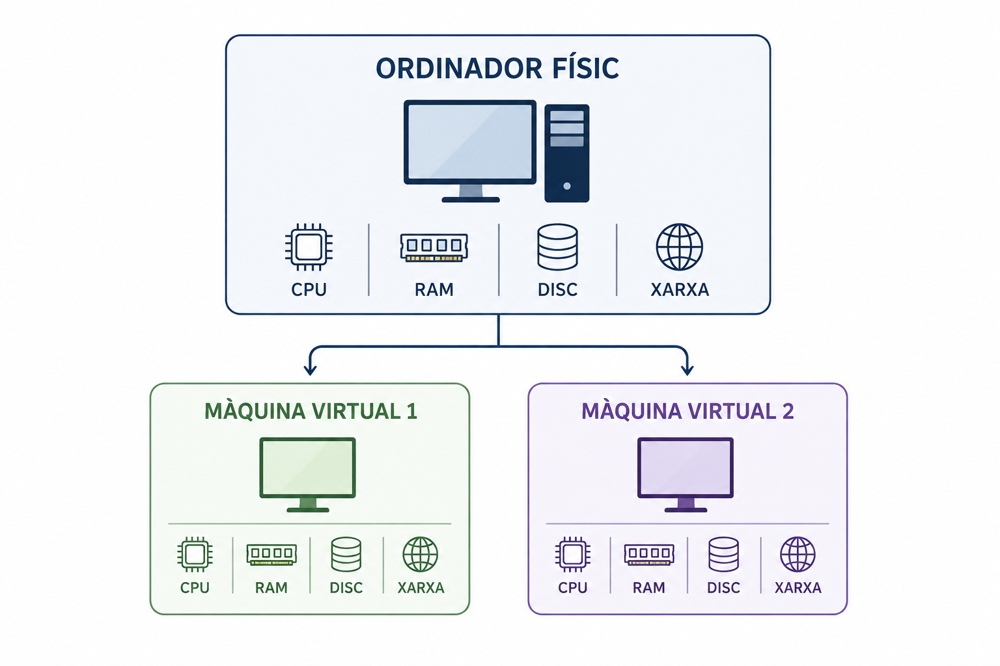
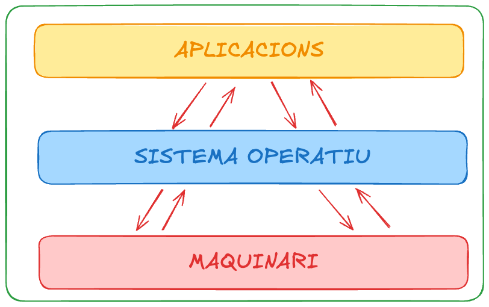
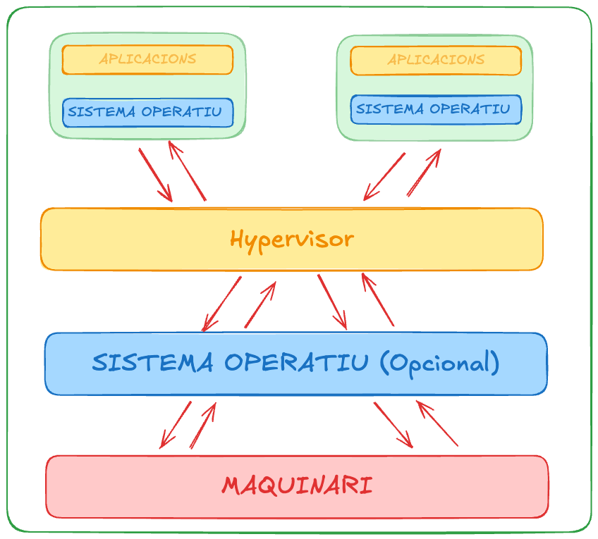
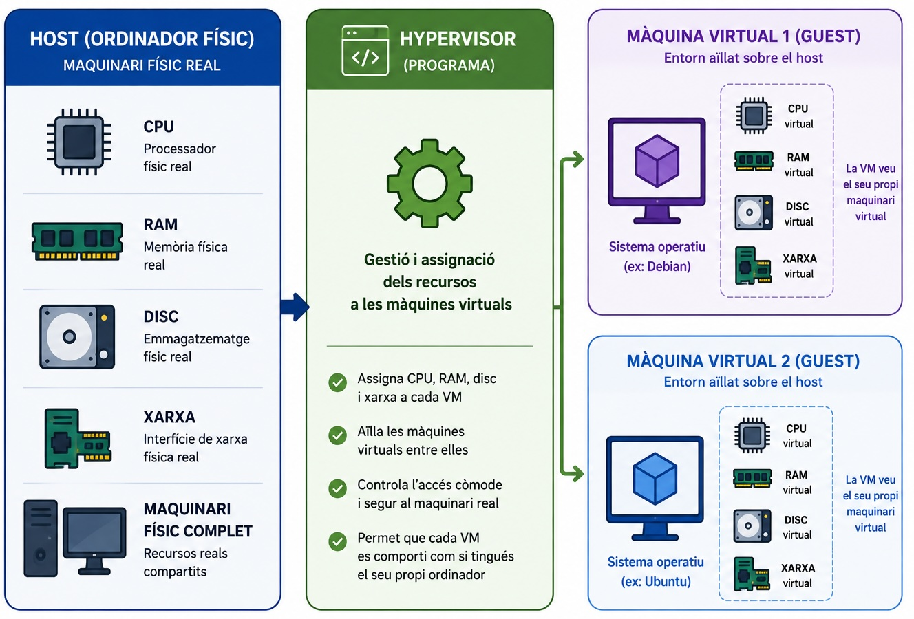

## Per què necessitem virtualització?

### Imagineu un món sense bus escolar

:::::: columns
::: {.column width="60%"}
-   Cada **estudiant** necessita el seu propi cotxe.
-   Cada cotxe necessita **recursos**.
-   Però cada cotxe transporta només una persona.
:::

::: {.column width="40%"}

:::

::: {.fragment style="text-align: center;"}
**Molts recursos utilitzats per transportar molt poca gent.**
:::
::::::

## La solució: compartir recursos

::::: columns
::: {.column width="60%"}

:::

::: {.column width="40%"}
-   Un únic vehicle **compartit**.
-   Diversos passatgers.
-   Els recursos es comparteixen.
:::
:::::

::: {.fragment style="text-align: center;"}
**Això és,..., la idea de la virtualització.**
:::

## Definició

::: fragment
### Definició formal

Tècnica que permet crear diversos entorns lògics independents sobre un mateix maquinari físic.
:::

::: fragment
### En poques paraules

**Un ordinador → es comporta com si fossin molts ordinadors.**
:::

::: notes
Llegir la definició formal ràpidament, sense aturar-s'hi gaire. La frase que ha de quedar és la segona. Es pot dir explícitament: "la frase que vull que us quedeu és aquesta."
:::

## Per a què serveix, a la pràctica?

-   Provar un sistema operatiu diferent **sense modificar el sistema operatiu principal**.
-   Tenir un entorn de treball **aïllat**: si l'espatlles, no afecta el teu ordinador real.
-   Poder **recuperar l'entorn fàcilment** després d'un error.
-   Executar diversos serveis o projectes **de manera separada en un sol servidor físic**.

::: notes
Sobre "recuperar l'entorn fàcilment": no anomenar encara "snapshots"; es pot dir "més endavant veurem com es fan còpies de les màquines virtuals."

EXEMPLE ORAL (no cal diapositiva nova): "Imagineu un servidor amb 64 GB de RAM. En lloc de tenir un sol sistema operatiu fent una sola tasca, hi podem crear: VM1 → servidor web, VM2 → base de dades, VM3 → servidor de proves. Totes comparteixen el mateix servidor físic, però cada una té el seu propi entorn." Pregunta: "Quin és l'avantatge respecte a tenir tres servidors físics separats?" Connecta directament amb la motivació inicial del bus: compartir infraestructura.
:::

## Com funciona?

::::: columns
::: {.column width="60%"}

:::

::: {.column width="40%"}
-   Un únic ordinador físic.
-   Diversos entorns virtuals.
-   Els recursos es comparteixen.
:::
:::::

::: {.fragment style="text-align: center;"}
**Un ordinador físic → diversos ordinadors virtuals**
:::

## Què és una màquina virtual?

::: {.fragment style="text-align: center;"}
**Una VM té el seu propi maquinari virtual.**
:::

::::: columns
::: {.column width="60%"}

:::

::: {.column width="40%"}
-   Sistema Operatiu
-   CPU virtual
-   Memòria RAM virtual
-   Disc virtual
-   Interfície de xarxa virtual
:::
:::::

## Host i Guest

Quan treballem amb màquines virtuals utilitzarem dos conceptes:

### Host

L'**ordinador físic** que proporciona els recursos.

### Guest

La **màquina virtual** que funciona sobre el host.

## Compartir ≠ interferir

Les VMs **comparteixen** els recursos físics del host, però mantenen el seu propi entorn, funcionant de manera **aïllada** entre elles.

-   Cada VM té el seu propi: sistema de fitxers, processos, configuració...
-   Els processos d'una VM estan **aïllats** dels processos de les altres VM.
-   Un problema dins d'una VM queda, en general, **aïllat** de les altres VM i del host.

::: notes
"Aquí hi ha una aparent contradicció. Si comparteixen els recursos, com poden estar aïllades?" \[pausa\] "Comparteixen el maquinari físic, però cada VM té el seu propi entorn."

Aclariment: no són bombolles màgiques. Com que comparteixen recursos físics, una VM que consumeixi massa CPU o RAM pot afectar el rendiment de les altres i del host. Aïllament ≠ independència total de recursos.
:::

## Esquema sense virtualització

{fig-align="center"}

## Esquema amb virtualització

{fig-align="center"}

## Hypervisor

{fig-align="center"}

## Dos tipus d'hipervisor

|   | Tipus 1 | Tipus 2 |
|------------------------|------------------------|------------------------|
| **On s'executa** | Directament sobre el maquinari | Sobre un sistema operatiu host |
| **Ús típic** | Servidors | Ordinadors personals |
| **Exemple** | VMware ESXi, Hyper-V | VMware Workstation, VirtualBox |

::: {.fragment style="text-align: center;"}
**Nosaltres utilitzarem VMware Workstation, un hipervisor de Tipus 2.**
:::

## D'on surten els recursos?

:::::::::::::::: columns
::::::::::::: {.column width="60%"}
::: {.fragment style="text-align: center;"}
**ORDINADOR: 16 GB RAM**
:::

::: {.fragment style="text-align: center;"}
↓
:::

::: {.fragment style="text-align: center;"}
**VM: 4 GB RAM**
:::

::: {.fragment style="text-align: center;"}
↓
:::

::: {.fragment style="text-align: center;"}
D'on surten aquests 4 GB?
:::

::: notes
Pausa real: NO fer clic al següent fragment. Deixar que responguin abans de revelar-ho.
:::

::: {.fragment style="text-align: center;"}
**De la RAM física de l'ordinador host.**
:::

::: {.fragment style="text-align: center;"}
I si en creo **dues** VM de 4 GB?
:::

::: {.fragment style="text-align: center;"}
I si en creo **quatre**?
:::

::: notes
Deixar que raonin en veu alta abans de tancar-ho. L'objectiu és que arribin sols a la conclusió: no podem assignar recursos il·limitadament, perquè les VM comparteixen els recursos físics reals del host.
:::
:::::::::::::

:::: {.column width="40%"}
::: {.fragment style="text-align: center;"}
**No podem assignar recursos il·limitadament: els recursos físics del host són finits.**
:::
::::
::::::::::::::::

## Virtual ≠ imaginari

Els recursos de la màquina virtual són **virtuals**, però utilitzen recursos físics reals.

| Recurs virtual | Recurs físic                 |
|----------------|------------------------------|
| CPU virtual    | CPU del host                 |
| RAM virtual    | RAM del host                 |
| Disc virtual   | Emmagatzematge del host      |
| Xarxa virtual  | Interfície de xarxa del host |

::: {.fragment style="text-align: center;"}
**La virtualització crea una abstracció del maquinari.**
:::

## Un últim càlcul

Un host amb **16 GB de RAM** executa:

::::::: columns
::: {.column width="50%"}
-   VM 1 → 4 GB
-   VM 2 → 4 GB
-   VM 3 → 4 GB
:::

::::: {.column width="50%"}
::: {.fragment style="text-align: center;"}
**Què li queda al host?**
:::

::: {.fragment style="text-align: center;"}
16 − 4 − 4 − 4 = **4 GB**
:::
:::::
:::::::

::: notes
Pausa oral aquí (no cal fragment nou): "Això vol dir que podem donar aquests 4 GB restants a una quarta VM?" Deixar que responguin (probablement diran que sí). "Teòricament encara hi ha 4 GB lliures, però no hauríem d'assignar tots els recursos del host a les VM: el propi host també en necessita per funcionar."
:::

::: {.fragment style="text-align: center;"}
És exactament així de senzill en un sistema real?
:::

::: {.fragment style="text-align: center;"}
**No del tot: el sistema operatiu host i la virtualització també necessiten recursos.**
:::